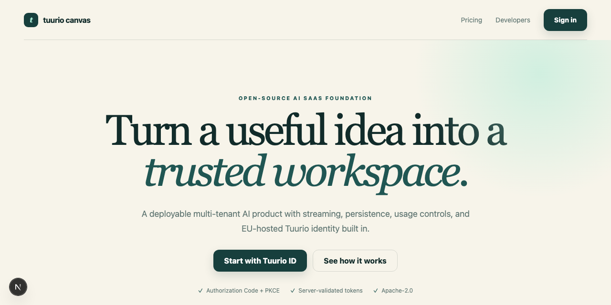
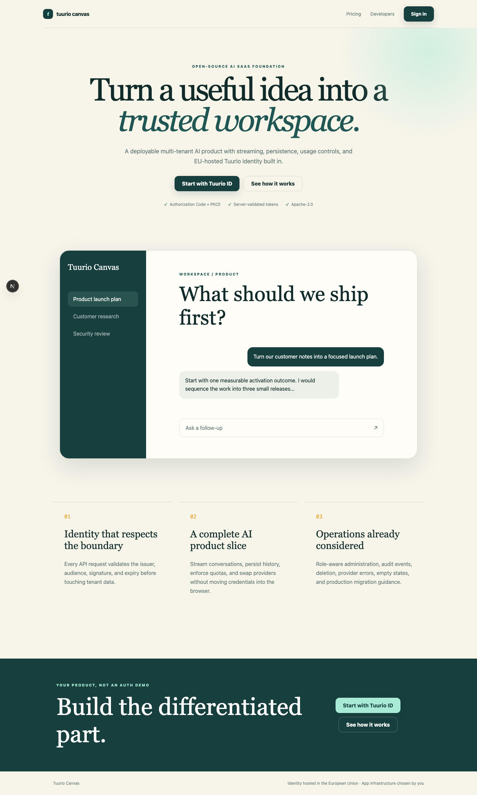

# Tuurio AI SaaS Starter

Production-oriented multi-tenant AI SaaS starter with Next.js, streaming AI, Postgres, usage controls, audit, and Tuurio ID.

[](https://github.com/Tuurio/ai-saas-starter/actions/workflows/verify.yml)



> Generated from [`Tuurio/auth_samples/ai_saas_starter`](https://github.com/Tuurio/auth_samples/tree/main/ai_saas_starter). Submit implementation fixes upstream so they are not replaced by the next synchronized release.

## What you get

- Standards-based OpenID Connect authentication with framework-native integration.
- Exact redirect and post-logout redirect handling.
- Protected-route and logout examples.
- A reviewed, pinned Tuurio provisioning workflow.

## Quickstart

1. Create a repository with **Use this template** or clone this repository.
2. Follow the framework-specific prerequisites below.
3. Review and run this pinned provisioning command:

```bash
npx manage-tuurio-id@1.1.6 init --framework nextjs --project-dir . --auth browser --yes --output json --campaign github_ai_saas --no-open --no-wait
```

4. Approve the exact command, then complete the secure browser handoff yourself.
5. Run the build and verify one real sign-in and sign-out.

Never paste credentials, client secrets, authorization codes, tokens, session cookies, or environment-file contents into an agent chat. Browser and native applications are public clients and must not contain a client secret.

## Runtime and verification

- Runtime: Node.js 24+
- Package manager: npm
- Verification: `npm ci && npm run typecheck && npm test && npm run build && npx playwright install --with-deps chromium && npm run test:e2e`

## Security model

This starter uses OpenID Connect Authorization Code flow. Browser and native clients use PKCE S256 and contain no client secret. Redirect and post-logout redirect URIs must match exactly. Identity comes from the established OIDC integration or an authenticated UserInfo request; decoded JWT payloads are never treated as validation. Keep generated local environment files ignored and never commit tokens or credentials.

## Framework instructions

# Tuurio AI SaaS Starter

A production-oriented, multi-tenant AI workspace with streamed conversations, tenant-isolated persistence, usage controls, role-aware administration, and Tuurio ID already wired in.



## Product journey

- Public landing and pricing pages that explain the product before sign-in.
- Tuurio ID Authorization Code with PKCE for browser authentication.
- Server-side JWT validation against the tenant issuer and JWKS before any data access.
- Organization-scoped conversations, usage, audit events, and administration.
- A provider-neutral streaming adapter with a safe built-in demo provider.
- Postgres persistence in production and an explicitly labelled, reset-on-restart memory store for local evaluation.

## Quickstart

1. Install, start the app, and explore the browser-only product demo:

```bash
npm ci
cp .env.example .env.local
npm run dev
```

Open `http://localhost:3000/demo`. The demo requires no account, makes no API or model request, and resets on refresh. Open `/setup` to get a pinned provisioning command generated for the exact origin currently in your browser.

2. To enable the real protected workspace for local development, review and run:

```bash
npx manage-tuurio-id@1.1.6 init --framework nextjs --project-dir . --base-url http://localhost:3000 --redirect-uri http://localhost:3000/auth/callback --post-logout-redirect-uri http://localhost:3000/logout/callback --public-config src/tuurio.public.json --auth browser --yes --output json --campaign github_ai_saas --no-open --no-wait
```

Complete the browser handoff yourself. Never give an agent credentials, tokens, authorization codes, session cookies, legal acceptance, or environment-file contents.

3. Restart the app after provisioning:

```bash
npm run dev
```

Without `DATABASE_URL`, authenticated requests use a visibly labelled in-memory demo store. Without an AI key, `AI_PROVIDER=demo` streams deterministic local copy and never pretends to call a production model.

## Production setup

1. Deploy once to obtain the stable HTTPS origin.
2. Re-run the pinned CLI with exact production `--base-url`, `--redirect-uri`, and `--post-logout-redirect-uri` values. Commit only `src/tuurio.public.json`; it contains public OIDC client data and no secret.
3. Set `DATABASE_URL`, run `npm run db:migrate`, and store `AI_API_KEY` only in the deployment's server-side secret store.
4. Set `AI_PROVIDER=openai-compatible`, `AI_BASE_URL`, and `AI_MODEL` for a compatible streaming chat-completions endpoint.
5. Verify one real sign-in, one streamed response, tenant isolation, and sign-out.

Tuurio identity is hosted in the EU. This does not imply that your application host, database, AI provider, prompts, or model outputs are EU-hosted; choose and disclose those services separately.

## Security boundaries

- The browser is a public OIDC client and never receives a client secret.
- The established OIDC library owns state, nonce, PKCE, callback processing, and token expiry.
- APIs reject requests until the access token signature, exact issuer, intended audience, and time claims validate.
- The issuer origin is the tenant boundary; every storage query also requires that tenant key.
- AI provider credentials stay server-only. Prompts, model output, access tokens, and authorization codes are not logged.
- The included in-process request limiter is a safe starter default, not a substitute for a shared production rate limiter across multiple instances.

## Verification

```bash
npm run typecheck
npm test
npm run build
npx playwright install chromium
npm run test:e2e
```

The Postgres adapter has an integration suite as well. Start a disposable database and run `TEST_DATABASE_URL=postgres://... npm test`; the suite verifies persisted tenant isolation and atomic quota enforcement.

## License

Apache-2.0. See `LICENSE` in the generated template repository.


## License

Licensed under the Apache License, Version 2.0. See [`LICENSE`](./LICENSE).
